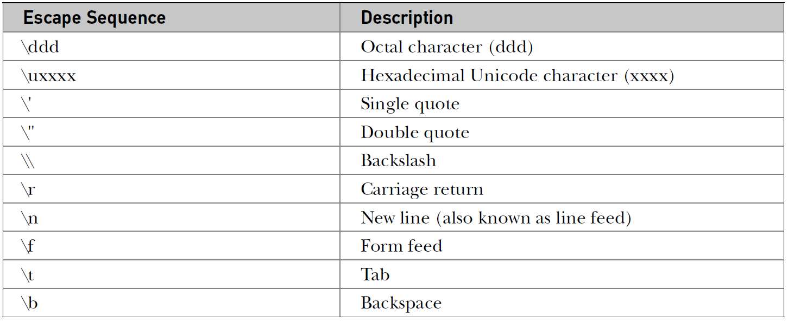
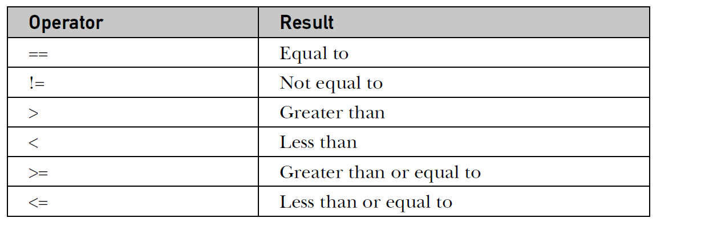
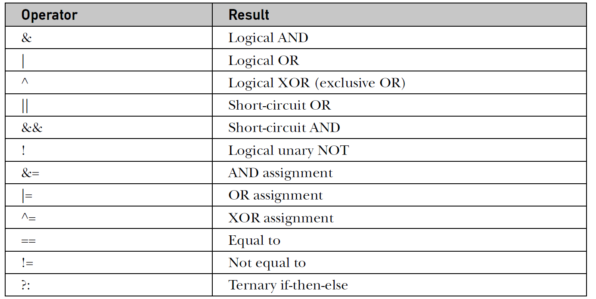
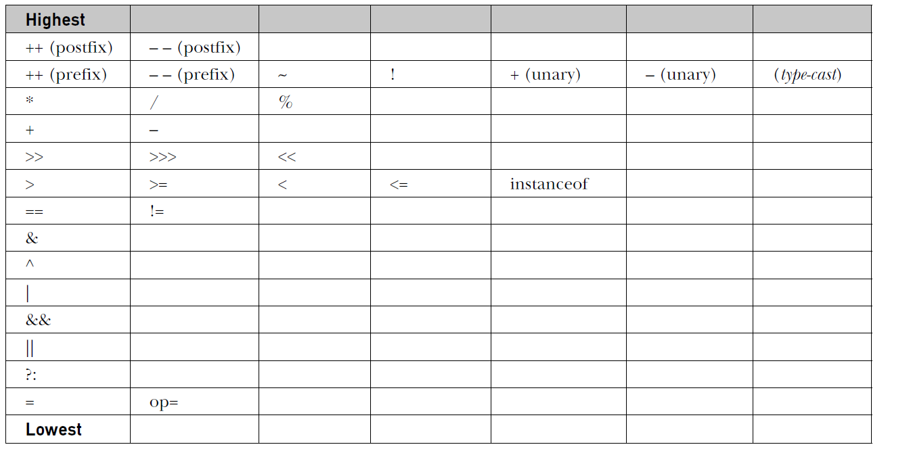

# Java Basics
generate-md --layout mixu-gray --input ./Java-Notes --output ./output
* **Strongly typed language**: Every variable, every expression has a type strictly defined. Assignments explicit or through parameter passing - are checked for type compatibility. No automatic type coercions or conversions of conflicting types. The type checking is imposed by compiler.
* **Primitive types**: There are 8 primitive types: `byte, short, int, long, char, float, double` and `boolean`. The primitive types can be grouped into 4 types. These primitive types represent `single` values as opposed to complex values. Primitive types are not modelled as objects.
    * *Groups of primitive types*:
        * *Integers*: `byte, short, int` and `long`.
        * *Floating point numbers*: `float` and `double`
        * *Characters*: `char`
        * *Boolean*: `boolean`
    * *Integer types*:
        * All integer types are signed integers - there is no unsigned representation.
        * *Sizes*: `byte`: 1 byte, `short`: 2 bytes, `int`: 4 bytes, `long`: 8 bytes.
    * *Floating point types*:
        * Java implements **IEEE-754** standard set of floating-point types and operators.
        * *Sizes*: `float`: Single precision - 32 bits. `double`: Double precision - 64 bits.
    * *Character types*: Java uses *Unicode* to represent characters. `char` data type is of size 2 bytes.
        * *ASCII* ranges from 0 to 127.
        * *ISO-Latin-1* ranges from 0 to 255
        * We can apply arithmetic operations on char data types.
        * Unicode reference: https://unicode-table.com/en/#control-character
    * *Boolean*: The `boolean` data type can have only either `true`  or `false`. When we print boolean value, it will print as string "true" or "false".

**Character Demo**
```java
class CharDemo{
    public static void main(String a[]){
        char ch1;
        ch1 = 'X';
        ch1++;
        System.out.println("ch1 contains: " + ch1); //Prints: ch1 contains Y
    }
}
```

**Boolean Demo**
```java
class CharDemo{
    public static void main(String a[]){
        boolean b = false;
        System.out.println("b value is: " + b); //prints false

        int a = 50;
        System.out.println("a > 30 is: " + (a > 30)); //prints a > 30 is true.

        if(b){
            System.out.println("b is true"); //This line will not be printed.
        }else{
            System.out.println("b is false"); //This line will be printed.
        }
    }
}
```

## Literals
### Integer Literals
* Integer literals can be expressed in base 10 (decimal), base 8 (octal), base 2 (binary) and base 16 (hexadecimal).
* Binary integers are introduced in *JDK 7*.
* By default, an integer literal is of type `int`.
* Default type of an integer literal is always `int`, even if it is expressed in hexadecimal, octal or binary.
* A suffix of `L` or `l` can be used to denote an integer as `long`.
**Example**: Demonstrates the integer literals and their conversion rules. Read through the comments carefully.

```java
public class Test{
    public static void main(String ags[]){
        byte b = 25; //int literal can be converted to byte type without causing loss.
        byte b2 = 256; //Compiler error. int literal cannot be converted without data loss.
        short s = 10; //Fine. Conversion without loss is possible.
        short s2 = 32768; //Compiler error. Data loss.
        int x = 30; //Fine. Literal is integer and x is also integer.
        int x2 = 2147483648; //Compiler error. Literal is not a valid integer. It is beyond the allowed range.
        long m = 45; //Fine. int literal can be converted to long without data loss.      
        long m2 = 2147483648; //Compiler error. Value is well within the range of long, but, the literal is not a valid int.
        long m3 = 2147483648L; //Fine. The literal is of type long.
        long m4 = 2147483648l; //Fine. A small `l` suffix can also be used.
    }
}
```

#### Literals in different base values
* Default value of an integer literal in any of the following representation is `int`
* *Hexadecimal*: 
    * Prefix the number with `0x` or `0X`  (small x and capital x)
    * Valid characters are 0 to 9 and a to f - both lower and upper case.
    * Eg: `0x3455`, `0x3a4D`
    * Suffix `L` or `l` to mark it as a long literal.
* *Octal*:
    * Prefix: `0`
    * Valid characters are: 0 to 7
    * Eg: `04537`, `0432`
    * Invalid: `0348` => `8` is not a valid character.
* *Binary*: (From JDK 7)
    * Prefix: `0b` or `0B`
    * Valid characters: 0 and 1.
    * Eg: `0B10111101`

#### Underscore Separator `JDK7`
> In JDK 7, underscores are allowed to separate digits. They cannot of course appear as leading or trailing characters. More than one underscore is also allowed.
**Eg**: `23_44__500`, `0B1111_0101_0011`
**Invalid**: `_34_45678` => Leading underscore is not valid.

### Floating point literals
* Underscores are allowed in floating point numbers as well.
* A floating point number is by default `double`
* Use suffix `f` or `F` to denote as a `float` literal.
* A float point literal can also be expressed in hexa decimal: `0x12.2P2` (P or p). The value followed by *p* is *binary exponent*
* `double num = 9_423_497.1_0_9;` is a valid expression.

### Boolean literals
> `true` and `false`

### Character literals
> Character literals are delimited by single quote (`'`) character. They occupy two bytes to accomodate Unicode characters. Character literals can also be expressed using escape sequences (where there is no direct representation is possible), hexa decimal and octal. A character is an index into Unicode character set. As characters are actually numbers, we can use arithmetic operations on characters.
**Eg**: `'A'`, `\743` (Octal number), `\u439A` (only 4 hexa digits).
**Eg**: `'\n'` (new line)

### String literals
> String literals in java are enclosed in double quotes. Unlike *C++*, strings in Java are not implemented as array of characters - rather, strings are implemented as objects.
* *Examples*:
    * `"Hello World"`
    * `"two\nlines"`
    * `" \"This is in quotes\""`
* A string literal in java must be expressed in single line. There are some languages which allow string literal to span across multiple lines.

**Escape Chars**: 


## Variables
TODO
* **Dynamic Initialization**: `int x = sum(4, 5);`
* **Scope**
* **Life time**
* Syntax: `type identifier [ = value ][, identifier [= value ] …];`
* Can't define a variable with the same name as in outer block.

```java
public class Test{
    public static void main(String ags[]){
        int n = 5;
        {
            int n = 50; //Compiler error. A variable with this name already exists in this scope.
        }
    }
}
```

* *Local Variable*: A variable defined inside a function is a local variable. Such variables must be initialized before their usage.
* *Default Values*: Local variables will have no default value. They must be explicitly initialized or assigned before their first usage.

```java
public class Test{
    public static void main(String ags[]){
        int x;

        System.out.println("x value is: " + x); //Compiler error. x is not initialized.
    }
}
```

## Type Conversion and Casting
* *widening conversion*: Type conversion is implicit.
* *narrowing conversion*: Explicit casting is required to cast between incompatible types.

```java
public class Test{
    public static void main(String ags[]){
        byte b = 5; //auto conversion. Compiler knows 5 is in range of byte. No loss in conversion.
        int x = 10; //No conversion. 10 is int literal.
        b = 10; 
        
        b = x; //Error: incompatible. int cannot be auto converted to byte.
        b = (byte)x; //Explicit casting.

        float k = 3.4; //Error: incompatible. Loss of precision in conversion. 3.4 is double precision.
        float y = 3.4f; //Well - 3.4f is float literal.
        float z = (float)2.3; //Casting.

        double m = k; //auto conversion. Compatible. No loss of precision.
    }
}
```

### Automatic type promotion in expressions
> The types `byte`, `short`, `char` operands will be auto promoted to `int` while evaluating expressions.

```java
public class Test{
    public static void main(String ags[]){
        byte a = 40;
        byte b = 50;
        
        //a and b are promoted to `int` before evaluating the expression. Hence the result is int
        //An int cannot be auto converted to byte
        //byte c = a + b; //Error.

        byte d = (byte)(a+b); //Alright. Explicit casting to byte

        byte e = (byte)(a * b);//Alright. But, this conversion involves loss of data as the product is larger than byte (127) can hold.
        
        System.out.println("e is: " +  e); //This results in -48. Unintended result.
    }
}
```

> *But why*: As the types `byte`, `short`, `char` are very small in range, expressions involving these can easily cross the range of the type. Consider `byte x = a * b;`, the result is beyond `127` which is the highest value that can be held in `byte`.

* Hence, technically, none of the binary arithmetic operators in java will work on `byte`, `short`, or `char` => They are promoted to `int` and then the operation is applied.
* All binary arithmetic operators will work only if both operands are same - if not, the smaller type operand is first promoted to larger type and then the operation is applied.
* Range order: `int` < `long` < `float` < `double`
* `byte b = 40; b++;` => No complaints. `++` can work on `byte`.

## Arrays
* An *array* is a group of homogenous elements, that are referred by a common name. 
* We can define an array of any type. 
* An array can have one or more dimensions.
* A specific element of an array is accessed by it's `index`.
* Array indices begin with `0`.
* Arrays in java is impelented as `class`.
* An array will have `length` instance property - `final` property.

### One dimensional arrays

```java
public class Test{
    public static void main(String ags[]){
        int x[]; //Declare an array of elements of type int.
        //But, the array itself does not exist yet.
        x[2] = 34; //Compiler error. Array x is not initialized.
    }
}
```

* *Allocate memory* for an array: 
    * `int x[] = new int[10];` => Allot memory within declaration.
    * Allocate in two statements in the following example.

```java
int x[];  //Declare
x = new int[10]; //Allot memory.
```

* Though local variables have no default values, array elements do.
    * All numberic types will be initialized to *ZERO* (`int`, `byte`, `char`, `short`, `double`, `float`)
    * `boolean` type is initialized to `false`.
    * Object types will be initialized to `null`.

```java
//The elements of array will be initialized to the default value of their data type.
public class Test{
    public static void main(String ags[]){
        int []x = new int[10]; //Note [] is before x.
        for(int i = 0; i < x.length; i++) //The scope of i is limited to the for loop.
            System.out.print(x[i] + "-");
        //Produces: 0-0-0-0-0-0-0-0-0-0-

        System.out.println(); //Take a line break

        boolean b[] = new boolean[3]; //Note [] is after b.
        for(int i = 0; i < b.length; i++) //Note that i is declared again.
            System.out.print(b[i] + "-");
        //Produces: false-false-false-

        System.out.println(); //Take a line break

        String p[] = new String[4]; //String is not a primitive type. It is an object.
        //Hence, the elements are initialized to null.
        for(int i = 0; i < p.length; i++)
            System.out.print(p[i] + "-");
        //Produces: null-null-null-null-
    }
}
```

* The `new` keyword allots memory for the array elements in `heap`
* *Deallocation*: If an array is a local variable, the memory allotted for it will be deallocated by the garbage collector after completing the function execution.

**Initialization**: Following example shows the syntax of initialization of array.

```java
public class Test{
    public static void main(String args[]){
        int x[] = {1, 2, 3}; //Initialized x[3].
        int y[];
        y = {1, 2, 3, 4, 5}; //Compiler error.

        y[0] = 20; //Assignment. Not initialization.
        y[1] = 2; //Assignment. Not initialization.
    }
}
```

### Multidimensional Arrays
> In java, *multidimensional arrays* are actually arrays of arrays.

* `int matrix[][] = new int[3][5];` => We can read this as *array of 3 int arrays with 5 elements each*. It is similar to 3X5 2D matrix.
* *Memory allocation*: Memory allocation can be done separately for each dimension. It is mandatory to allot memory for left most dimension (first dimension) as in the following example. Hence, each of the second dimension can have a different sized array.
* *Jagged Array*: A multi dimensional array with non uniform size for each dimension. Following example demonstrates a jagged array.

```java
public class Test{
    public static void main(String ags[]){
        int []x[]; //Note differenc. We can use int x[][] or [][]x or []x[].
        x = new int[4][]; //first dimension has 4 elements.
        x[0] = new int[1]; //first row contains 1 element.
        x[1] = new int[2]; //second row contains 2 elements.
        x[2] = new int[0]; //third row contains 0 elements.
        x[3] = new int[10]; //fourth row contains 10 elements.

        for(int r = 0; r < x.length; r++){
            System.out.println(); //line break.
            for(int c = 0; c < x[r].length; c++){ //x[r].length is different for each row.
                System.out.print(x[r][c] + "-");
            }
        }
    }
}
```

**Output**
```
0-
0-0-

0-0-0-0-0-0-0-0-0-0-
```

**Visulization of 2D array with different sizes of rows - Jagged Array**


**Initializing 2D arrays**

```java
public class Test{
    public static void main(String args[]){
        int x[][] = { //3 rows with each row of different size.
            {1, 2, 3}, //x[0] is int[3]
            {}, //x[1] is int[0]
            {0, 3, 1, 4, 5} //x[3] is int[5]
        };

        int y[][] = new int[2][];
        y[0] = {3, 4, 5}; //Compiler error. This syntax is valid only in initialization.
    }
}
```


## Operators
### Arithmetic Operators
> Arithmetic operators can only be applied to numeric types. Hence, they can be applied to all primitive types except `boolean`. Note that `String` is not a primitive type, but, java identifies string literals and the concatenation operator `+` is defined for strings.


> As discussed earlier, these arithmetic operators need both operands to be of same type. If not, the smaller type will be promoted to the larger type and then the operation itself is applied. The result type of any of these arithmetic operators is same as the type of operands.

```
Consider the following case:
int m = 3;
float x = m + 3.0;  //float x = int + double
Step 1: float x = 3.0 + 3.0; //float x = double + double
Step 2: float x = 6.0; //Result is of type double.
Step 3: Compiler error. A double cannot be assigned to float. Possible loss of precission.
```

* The modulus operator `%` can also be applied to floating point numbers.

### Bitwise Operators
> Java *bitwise* operators can be applied to all integer types (`byte`, `short`, `char`, `int` and `long`).


```java
public class Test{
    public static void main(String args[]){
        int x = 0B1010_1100_1001_1000;
        int y = 0B1100_0101_1101_1101;

        //1's complement or binary NOT
        int z = ~x; //0B0101_0011_0110_0111

        System.out.println("Z is as expected " + (z == 0B1111_1111_1111_1111_0101_0011_0110_0111));
        System.out.println("Z is as expected " + (z == 0XF_F_F_F_5_3_6_7));

        z = x & y;  
        System.out.println("Z is as expected " + (z == 0B1000_0100_1001_1000));
    }
}
```

* All integer types are signed except `char`. Java uses *two's compliment* system to represent negative numbers. (1's complement + 1 yeilds the 2's complement)
* A left shift `<<` moves all it's bits by 1 position, by filling the LSB with a `0`.
* The types `byte`, `short`, `char` will be promoted to `int`, as with arithmetic operators, before performing bitwise operation. During promoting, these operands will retain their sign, meaning, negative values will have all `1`s in the additional bytes added.

```java
public class Test{
    public static void main(String args[]){
        byte a = 64;
        byte b = 2;

        byte c = (byte) (a << b); //cast to byte as it is already promoted to int.
    }
}
```

* A `<<` by 1 bit will double the value and a `>>` by 1 bit will halve the value.
* *Sign extension*: With right shift, the MSB will be filled with the same value as it was before shifting - to retain the sign of the number.
* **Unsigned Right Shift**: `>>>` operator will fill the MSB with `0`, with each shift.

```
11111111 11111111 11111111 11111111 –1 in binary as an int
>>>24
00000000 00000000 00000000 11111111 255 in binary as an int
```

### Relational Operators
> The relational operators are used to compare two values and yield a `boolean` result. These are binary operators. Unlike C++, boolean is not represented as integer.



### Boolean Logical Operators
> All these operators operate on `boolean` operands and result in `boolean`.



* `&&` and `||` are short-circuit counter parts for `&` and `|` operators. Following example demonstrates *short-circuit* operators.

```java
public class Test{
    public static void main(String args[]){
        int a = 10;
        int b = 40;
        int c = 0;

        if((a > b) && (c = a + b) > 10) //short-circuit AND operator.
            System.out.println("Yes");
        else
            System.out.println("No");

        System.out.println("After short-circuit AND, C value is: " + c);

        if((a > b) & (c = a + b) > 10) //AND operator.
            System.out.println("Yes");
        else
            System.out.println("No");

        System.out.println("After AND, C value is: " + c);
    }
}
```

**Output**

```
No
After short-circuit AND, C value is: 0
No
After AND, C value is: 50
```

* *Note*: The operators `&`, `|` and `^` are overloaded to work in *bitwise* operations and logical operations.

### Other operators

* Following are the leftover operators.
    * `=`: Assignment
    * `?:`: A `ternary` operator works like *if-else*.
* `?:` operator requires both the expressions 2 and 3 be of same type (compatible). They cannot be void. `expression1 ? expression2 : expression3`

### Operator Precedence

> In binary operations, the order of evaluation is left to right (except for assignment, which evaluates right to left). Although they are technically separators, the [ ], ( ), and . can also act like operators. In that capacity, they would have the highest precedence.



* *Parentheses*: `()` will raise the precedence to top. Using `()` will not degrade the performance of the program.

## Control Statements

### Conditional control statements

* `if`, `if else`: Only one statement is allowed in `if` or `else` block. `if` and `if else` statements can be nested.

```java
if (condition) statement1;
else statement2;
```

* `switch` is a multiway branching statement.

```java
switch (expression) {
    case value1:
        // statement sequence
        break;
    case value2:
        // statement sequence
        break;
    .
    .
    .
    case valueN :
        // statement sequence
        break;
    default:
    // default statement sequence
}
```

* Case values must be unique (no two cases can have same value) and constant (like literals) expressions.
* Case value type must be compatible with case expression.

```java
public class Test{
    public static void main(String args[]){
        int x = 100;
        int m = 50;

        switch(x){
            case 10:
                System.out.println("x is 10");
                break;
            case m: //Compiler error. Constant expression required.
                System.out.println("x is same as m");
                break;
            case "Hello": //Compiler error. Incompatible with switch expression.
                System.out.println("x is Hello");
                break;
            default:
                System.out.println("X did not match any case");
        }
    }
}
```

* The expression of switch must be of type `byte`, `short`, `int`, or `char`.
* Note that `long` is not allowed as switch expression.

```java
public class Test{
    public static void main(String args[]){        
        switch(10.5){ //Compiler error. incompatible types: possible lossy conversion from double to int
            //Empty switch is a valid statement.
        }
    }
}
```

* Once a case value matches, all the statements following by matching case will be executed until either break statement or end of switch block, including `default`.

```java
public class Test{
    public static void main(String args[]){
        
        switch(10){ 
            case 1:
                System.out.println("X is 1");
                break;
            case 10:
                System.out.println("X is 10");
                //Notice that there is no break.
            case 20:
                System.out.println("X is 20");
            default:
                System.out.println("No case matched.");
        }
    }
}
```

**Output**

```
X is 10
X is 20
No case matched.
```

* An empty switch is legal.

```java
public class Test{
    public static void main(String args[]){
        //Legal. 
        switch(10){ 
        }

        //Legal. 
        switch(10){
            default:
                System.out.println("No cases matched");
        }

        //Legal.
        switch(10){
            case 5:
                System.out.println("Matching 5");
        }
    }
}
```

* From *JDK 7*, *string* is allowed to be a case expression.

```java
public class Test{
    public static void main(String args[]) {
        String str = "two";
        switch(str) {
            case "one":
                System.out.println("one");
                break;
            case "two":
                System.out.println("two");
                break;
            case "three":
                System.out.println("three");
                break;
            default:
                System.out.println("no match");
                break;
        }
    }
}
```

### Iterative Statements
* `for`, `while`, `do while`
* A loop control variable declared in `for` loop will case to exist after the loop.
* `for(; ; );` is an infinite loop.
* *For-Each* variant of for loop or enhanced for loop: *No new keyword is required*.
* The for each variant iterates through a collection from first element to last element.
* The collection can be an array or a collection defined in collection framework.
* The for each loop can be terminated prematurely, using `break`.

```java
public class Test{
    public static void main(String args[]){
        int nums[] = { 1, 2, 3, 4, 5, 6, 7, 8, 9, 10 };
        int sum = 0;
        for(int i=0; i < 10; i++) sum += nums[i];
        System.out.println("Sum is: " + sum);
        
        sum = 0;
        for(int x: nums) sum += x;
        System.out.println("Sum is: " + sum);
    }
}
```

**Output**

```
Sum is: 55
Sum is: 55
```

* The iteration variable of for each is readonly - assigning a value to it will not change the value in the array itself.

```java
public class Test{
    public static void main(String args[]){
        int nums[] = { 1, 2, 3, 4, 5, 6, 7, 8, 9, 10 };
        
        for(int i=0; i < 10; i++)  nums[i] = nums[i]+1; //This will increment the value in array.
        for(int x: nums) System.out.print(x + "-");

        System.out.println(); //line break.
        
        for(int x: nums) x = x + 1; //x will change. But, not the actual array element.
        for(int x: nums) System.out.print(x + "-");
    }
}
```

**Output**

```
2-3-4-5-6-7-8-9-10-11-
2-3-4-5-6-7-8-9-10-11-
```

* However, we can modify the object memebers using for each.

```java
class Sample{
    public int m = 0;
}
public class Test{
    public static void main(String args[]){
        Sample objects[] = { new Sample(), new Sample(), new Sample(), new Sample() };
        
        for(int i=0; i < objects.length; i++)  objects[i].m++;
        for(Sample x: objects) System.out.print(x.m + "-");

        System.out.println(); //line break.
        
        for(Sample x: objects) x.m++; //We are directly operating on object. Hence, array member's m will be incremented.
        for(Sample x: objects) System.out.print(x.m + "-");
    }
}
```

**Output**

```
1-1-1-1-
2-2-2-2-
```

* Iterating multi dimensional arrays using for each: `for(int x[]: nums)`

```java
public class Test{
    public static void main(String args[]){
        int nums[][] = {
            {1, 2, 3}, {2, 3, 4}, {3, 4, 5}, {4, 5, 6}
        };
        int sum = 0;

        for(int[] row: nums){
            System.out.println();
            for(int element: row)
                System.out.print(element + "-");
        }
    }
}
```

**Output**

```
1-2-3-
2-3-4-
3-4-5-
4-5-6-
```

### Jump Statements
* `break`, `continue`, `return`
* Other category of statements that can influence control flow: `try`, `catch`, `throw`, `throws`, `finally`
* A `break` statement can terminate the loop prematurely. In `switch`, it will exit the `switch`.
* `continue` will terminate the current iteration of the loop in which it is placed.

* **break label**: This form of `break` can break out of a code block with matching *label*, not necessarily a loop or `switch`. A *label* is any valid java identifier followed by a colon (:).

```java
public class Test{
    public static void main(String args[]){
        boolean toBreak = true;
        one: {
            two: {
                three: {
                    System.out.println("In block three.");
                    //Let's now break out of block two.
                    if(toBreak) break two; //if statement is needed. If not, compiler complains about unreachable code.
                }
                System.out.println("This statement will not be reached.");
            }
            System.out.println("In block one");
            if(toBreak) break one; //if statement is needed. If not, compiler complains about unreachable code.
            System.out.println("Block one last statement"); //unreachable.
        }
        System.out.println("Out of all blocks.");
    }
}
```

**Output**

```
In block three.
In block one
Out of all blocks.
```

* We can `break` out of an outer loop from within a deeply nested loop using `break label` form.

```java
public class Test{
    public static void main(String args[]){
        outer: for(int i = 1; i <= 5; i++){
            for(int j = 1; j <= 5; j++){
                if(i+j == 8) break outer;
                System.out.print("(" + i + ", " + j + ")-");
            }
        }
    }
}
```

**Output**

```
(1, 1)-(1, 2)-(1, 3)-(1, 4)-(1, 5)-(2, 1)-(2, 2)-(2, 3)-(2, 4)-(2, 5)-(3, 1)-(3, 2)-(3, 3)-(3, 4)-
```

