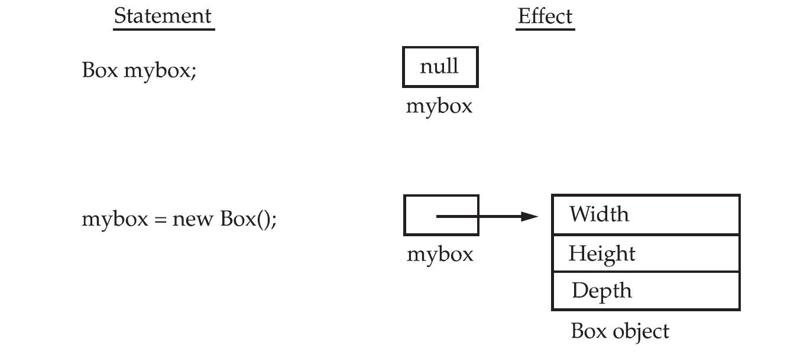
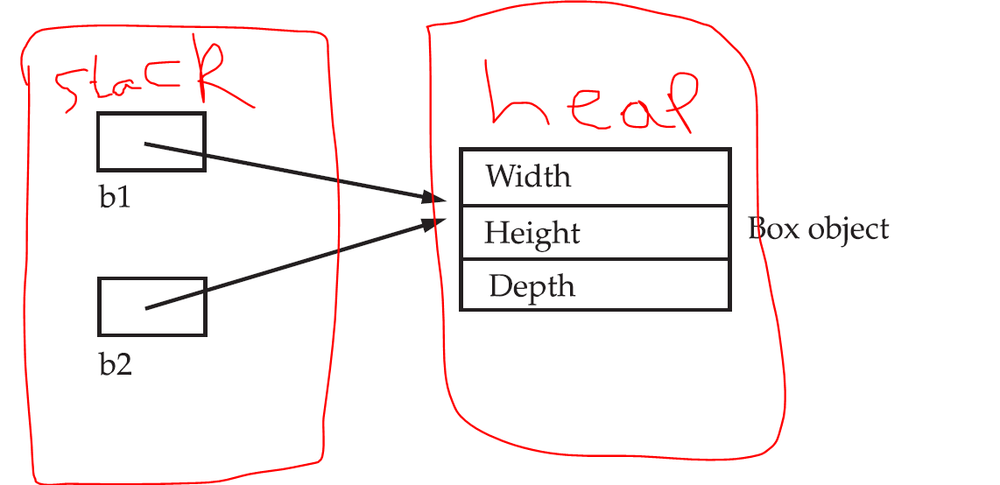

# Java Classes
* A class in java defines a new data type. An *obect* is an *instance* of a class.
* The data or variables (non static), defined within a `class` are called *instance variables* or *instance members*.
* The functionality of a class is defined as *methods*.
* Declaraing a class is *creating a new data type*. We can create varialbes of this new type.

**A simple class**

```java
class Box {
	double width;
	double height;
	double depth;
}
```

* Instantiating a class: `Box b = new Box();`
* *Member access operator*: Members of an object are accessed using dot `.` operator.
* A java source file name should match exactly same as the `public class` that is defined in the file.
* No more than one `public class` can be defined in one source file.
* More than one `class` can be defined in a source file. Only one of them, at most, can be a `public class`.
* The java compiler, takes *.java* file as input and produces a *.class* file for each class that is defined in the source file.

**Instantiation**: Creating an object of a class is a two step process. Create a reference variable and create the object itself that will be referred by the reference variable. The `new` operator dynamically (*at runtime*) allocates memory for the object and returns it's reference.

```
Box b; //b is a reference variable that can refer to a Box class object.
b = new Box(); //Create a box object in heap. b is now referring to this newly created object.

Box b2 = new Box(); //We can combine creation of reference variable and instantiation of object into one statement.

b = new Box(); //A third object of class Box is created and its reference is stored in b. Hence, we lost reference to the first object that was created earlier.
```

**Visualization of object and reference**



* The part `Box()` is called the *constructor* of the class.
* If we **don't** define a *constructor* for a class, the compiler adds a definition of *default constructor* to the class.
* In the previous example of *Box* `class`, we have not defined any constructor, but, were able to use one - this is the one provided by the java compiler.
* Java compiler **cannot** provide the *default constructor* for a `class` if its super class does not have a no argument *constructor*. Following example demonstrates it.

```java
//Compiler error.
class BasicShape{
	//This class does not have a no argument or default constructor.
	BasicShape(int x){
		System.out.println("Constructing BasicShape object");
	}
}

class Box extends BasicShape{
	//Compiler cannot add default constructor, as it is supposed to call default constructor of super class.
	//The super class does not contain a default constructor.
}
public class Test{
    public static void main(String args[]){
    	Box b = new Box();
    }
}
```

* The `new` operator can fail to allot memory if there is no sufficient memory available. In such cases, the `new` operator throws an exception.

**Assigning reference variables**

```
//This code fragement creates two reference variables, but just one object.
Box b1 = new Box();
Box b2 = b1; //Now, both b1 and b2 are pointing to the same Box object.
```



## Methods Basics

```java
class Box {
	double width;
	double height;
	double depth;
	
	void printVolume() {
		System.out.print("Volume is ");
		System.out.println(width * height * depth);
	}
}

public class Test{
    public static void main(String args[]){
    	Box b1 = new Box();

    	b1.width = 10; //assign values to members.
    	b1.height = 20;
    	b1.depth = 15;

    	b1.printVolume(); //call member function printVolume() on object b1
    }
}
```

## Constructor
* A *constructor* initializes an object immediately upon its creation. It has the same name as the class.
* A parameter less *constructor* is called default constructor.
* If we don't define any *constructor* for a class, compiler adds a default *constructor*.
* The default *constructor* initializes all the *instance* members to their default values.
* Compiler adds a call to `super()` in all constructors as a first statement - if you don't add it. Following example demonstrates it.

```java
class BasicShape{
	BasicShape(){
		System.out.println("BasicShape default constructor");
	}
    //This class does not have a no argument or default constructor.
    BasicShape(int x){
        System.out.println("BasicShape one argument constructor");
    }
}

class Box extends BasicShape{
    //Compiler cannot add default constructor, as it is supposed to call default constructor of super class.
    //The super class does not contain a default constructor.
    Box(){
    	//no call to super. But, compiler adds super() here.
    	System.out.println("Box default constructor");
    }

    Box(int m){
    	super(m); //You have added a call to super. So, compiler will not add.
    	System.out.println("Box one argument constructor");
    }

    Box(int a, int b){
    	//no call to super. Compiler adds super() here.
    	System.out.println("Box two argument constructor");
    }
}
public class Test{
    public static void main(String args[]){
        Box b = new Box();
        b = new Box(1);
        b = new Box(1, 2);
    }
}
```

## `this` keyword
* The `this` keyword is available in *constructor* and `non-static` methods of a class.
* *In constructor*: It is a reference to the object that is being constructed - in `constructor`.
* *In instance method*: It is a reference to the object on which the current method is being called - in a `non-static` member function.

## Instance variable hiding
* A local variable or parameter can have same name as an instance variable - in `constructor` or `instance` member function.
* Local variable hides the instance variables, in which case, the instance variables can still be accessed using `this`

```java
//Notice that the parameter names are same as instance members.
Box(double width, double height, double depth) {
	this.width = width; //width is local variable and this.width is instance variable.
	this.height = height;
	this.depth = depth;
}
```

## Garbage Collection
Java handles deallocation automatically, which is called `garbage collection`. When there are no references to an object exist, that object is assumed to be no longer needed, and the memory occupied by that object is reclaimed. Garbage collection occurs sporadically during the execution of a program. Different JVMs will take different approach to garbage collection.

### The `finalize()` Method
* The `finalize()` method gets called just before garbage collection, but not immediately after its reference goes out of scope.
* In C++, there is a destructor, which gets called immediately after an object goes out of scope - which is different from java's `finalize()`.

```java
protected void finalize( )
{
	//finalization code here
}
```

## Method Overloading
Defining more than one function with the same name, but different types/number of parameters is called method overloading. 
* **Static - Method Binding**: Java binds a method to call based on
	* Class on which the method is being called
	* Object (not the reference type) on which the method is being called. [Reference type may be different from the type of object that it is referring to]
	* Method name that is being called.
	* What are parameters (number, order and types) that are being supplied in the method call
	* Note: A method to call cannot be decided based on the return type.

```java
class Box {
	void print() {
		System.out.println("No params");
	}
	void print(int x){
		System.out.println("One int param");
	}
	//Error. This method takes same params as above one.
	//Methods cannot be distinguished based on return type.
	/*int print(int x){
		System.out.print("One int param and returns int");
	}*/
	void print(double x){
		System.out.println("One double param");
	}
}

public class Test{
    public static void main(String args[]){
    	Box b = new Box();
    	b.print(); //Calls no argument version.
    	b.print(4); //Calls int version. If int version does not exist, this will call double version.
    	b.print(4.5); //Calls double version. If double version does not exist, it cannot call int version. Then, it would be error.
    }
}
```

* The following example demonstrates a case which is not a method overloading.

```java
//This is not overloading.
class Box {
	void print() {
		System.out.println("No params Box");
	}
}
class Drum{
	void print(int x) {
		System.out.println("One int param Drum");
	}
}
public class Test{
    public static void main(String args[]){
    	Box b = new Box();
    	b.print();
    	Drum d = new Drum();
    	d.print(5);
    }
}
```

### Method Resolution Rules
> Java looks for a match between the arguments used to call the method and the method's parameters. If not no match is found, then it applies certain rules to find a match. The method resolution process can either *find a match*, or can result in *no match found* or ambigous between different functions.

1. *Exact Match*: If there is an exact match of type and number of parameters - resolve to it. We have seen exact match examples above.
2. *Widening conversion*: Apply widening conversion and check. The `Object` class is wider (more general) than all classes. A sub class is *narrower* than its super class.
	* If there is exactly one match - success - bind it. 
	* If there is more than one match - error - report ambiguity.
	* If there is no match - error - report missing method.

```java
//Widening conversion - success.
class Box {
	void print(int x, int y) {
		System.out.println("int x, double y");
	}
	void print(double x, double y){
		System.out.println("double x, double y");
	}
}
public class Test{
    public static void main(String args[]){
    	Box b = new Box();
    	b.print(3, 4); //Exact match.
    	b.print(3.0, 4.0); //Exact match (double, double)
    	b.print(3, 4.0); //Widen - match (double, double)
    	b.print(3.0, 4); //Widen - match (double, double)
    }
}
```

```java
//No match error and ambiguity error
class Box {
	void print(double x, int y) {
		System.out.println("double x, int y");
	}
	void print(int x, double y){
		System.out.println("int x, double y");
	}
}
public class Test{
    public static void main(String args[]){
    	Box b = new Box();
    	b.print(3.0, 4); //Exact match - (double, int)
    	b.print(3, 4); //Ambiguity error: By widening - can match (double, int) or (int, double).
    	b.print(3.0, 4.0); //No match error: No match. Widening cannot help.
    	b.print(3, 4.0); //Exact match - match (int, double)
    }
}
```

2. *Widening With Objects*: For objects, match is made to the most specific class.

```java
public class Test{
    static void test(String str){
    	System.out.println("String str");
    }
    static void test(Object obj){
    	System.out.println("Object obj");
    }
    public static void main(String args[]){
    	test("Hello"); //Exact match - (String)
    	Test t = new Test();
    	test(t); //Widening match - (Object)

    	test(null); //This can match both methods. Compiler choses the most specific class. As String is a subclass of Object
    				//It matches - (String)
    				//Hence, no ambiguity
    }
}
```

2. *Widening with Objects*: Report ambiguity, if there exists more than one method that can match.

```java
public class Test{
    static void test(String str){
    	System.out.println("String str");
    }
    static void test(int[] x){
    	System.out.println("int[] x");
    }
    public static void main(String args[]){
    	test("Hello"); //Exact match - (String)
    	int x[] = {1, 2, 3};
    	test(x); //Exact match - (int[])
    	x = null;
    	test(x); //Exact match, though it is null - (int[])

    	test(null); //Ambiguity - both int[] and String are subclasses of Object.
    				//As they are not in same hierarchy, there is no specific implementation to chose.
    }
}
```

3. *Auto-boxing*: **TODO**
4. *Var-args*: **TODO**


## Constructor Overloading
* Constructors can be overloaded similar to method overloading.
* A class can contain multiple constructors.
* A constructor can call another constructor of the same class.
* Constructor is called using `this` reference.
* Call to a constructor must be the first statement - following example demonstrates it.

```java
public class Test{
	int x, y;

	Test(){
		this(5); //Call one argument constructor.
		System.out.println("Default constructor");
	}
	Test(int x){
		System.out.println("One arg constructor");
		this(x, 10); //Error: Call to constructor must be first statement.
	}

	Test(int x, int y){
		this.x = x;
		this.y = y;
		System.out.println("Two arg constructor");
	}

    public static void main(String args[]){
    	Test t = new Test(); //Call default constructor.
    	Test t2 = new Test(5); //Call (int) constructor.
    	Test t3 = new Test(3, 4); //Call (int, int) constructor.
    }
}
```

## Access Control - Introduction
* Java defines access modifiers `public`, `private`, `protected` along with a default access level.
* A `public` member is accessible from any other code.
* A `private` member is accessible only from other members of the same class.
* `protected`
* The *default*

## Understanding `static` Members & Block
* A `static` member is the `class` property as opposed to *instance* property.
* A `static` member (method or variable) can be called with reference to the `class` name or any object of the class.
* A `static` method cannot have access to `this` - the calling object - as there is no calling object itself.
* As `static` method cannot access `this`, there is no way to access any instance properties - as there is no object reference available.
* A `static` method will not have access to `super` - which is used in case of method overriding.
* **Static Block**: It is a block of code, labelled as `static` in a class
	* Can be used to initialize static members of the class.
	* There can be zero or more static blocks in a class.
	* The static blocks are executed during class loading - in the order in which they are defined.

## The `final`
* We can define a *constant* using the keyword `final`.
* As a `final` member is a constant, it must be initialized either within declaration or within constructor.

**Final member not initialized**
```java
public class Test{
	final int x; //Compiler error: variable x not initialized in the default constructor
    public static void main(String args[]){
    	
    }
}
```

**Final member initialized in declaration**
```java
public class Test{
	final int x = 50; //Perfect.
    public static void main(String args[]){
    	Test t = new Test();
    	System.out.println(t.x);
    }
}
```

**Final member initialized in constructor**
```java
public class Test{
	final int x; 
	Test(){
		x = 45;
	}
    public static void main(String args[]){
    	Test t = new Test();
    	System.out.println(t.x);
    }
}
```

**Final member initialized in declaration and assigned in constructor: Error**
```java
public class Test{
	final int x = 50; 
	Test(){
		x = 45; //error: cannot assign a value to final variable x
	}
    public static void main(String args[]){
    	Test t = new Test();
    	System.out.println(t.x);
    }
}
```

**Final member is being assigned: Error**
```java
public class Test{
	final int x; 
	Test(){
		x = 45;
	}
    public static void main(String args[]){
    	Test t = new Test();
    	t.x = 50; //error: cannot assign a value to final variable x
    	System.out.println(t.x);
    }
}
```

**Array length is a final member of the class**
```java
public class Test{
    public static void main(String args[]){
    	int []x = {3, 4, 5};

    	x.length = 34; //error: cannot assign a value to final variable length
    }
}
```

## Nested Classes
* A class defined inside another class is called *nested class*
* There are two types of nested classes.
	* *static nested class*: An nested class with `static` modifier.
	* *non-static nested class* - Also called *inner class*
	* *local inner class* - A class that is defined inside a method block - may be even inside a `if` block.
	* *Anonymous inner class* - An inner class without a name.
* **Inner Class**: A class that is defined within another class, without modifier `static` is called an inner class.
	* An inner class can only be instantiated with reference to an outer class object.
	* An inner class will have access to all members of its containing class, including `private` members.

```java
class Box{
	private int width;

	class BoxInner{
		void print(){
			System.out.println(width);
		}
	}

	void check(){
		//Inner class object bi is being created with reference to this - the calling object.
		BoxInner bi = new BoxInner();
		bi.print();
	}
}
public class Test{
    public static void main(String args[]){
    	Box b = new Box();
    	b.check();
    }
}
```

**An inner class object can be created only with a reference to outer class object**
```java
class Box{
	private int width;
	class BoxInner{
		void print(){
			System.out.println(width);
		}
	}
	void check(){
		
	}
}
public class Test{
    public static void main(String args[]){
    	Box b = new Box();
    	
    	Box.BoxInner bi = b.new BoxInner(); //
    	bi.print();
    }
}
```


* **Local Inner Class**: An inner class can be defined within a function. Such inner class object will have access to all members of its out class as in the case of other forms of inner class.

```java
class Box{
	private int width;
	
	void check(){
		class BoxInner{
			void print(){
				System.out.println(width);
			}
		}
		BoxInner bi = new BoxInner();
		bi.print();
	}
}
public class Test{
    public static void main(String args[]){
    	Box b = new Box();
    	b.check();
    }
}
```

**Anonymous Inner Class**
```java
interface Printable{
	void print();
}
class Box{
	private int width;
	
	Printable check(){
		int m = 50;
		//Create an anonymous inner class implementing the interface Printable.
		Printable p = new Printable(){
			public void print(){ //Must be public as it is implementing a method of interface.
				System.out.println(width);
				System.out.println(m);
			}
		};
		p.print();
		m += 10; //error: local variables referenced from an inner class must be final or effectively final
		return p;
	}
}
public class Test{
    public static void main(String args[]){
    	Box b = new Box();
		Printable p = b.check();    	
		p.print();
    }
}
```

## String class
* `String` is not a primitive type. 
* Every string literal is an instance of class `String`. `int l = "Hello".length();`
* String is immutable.

## `static` intialization
```java
class Some{
    static{
        m();
    }
    static void m(){
        System.out.println("X is : " + x);
    }
    static int x = 10;
}
public class Test{
    public static void main(String args[]){
        //Class meta data is available. But, the class itself is not loaded yet.
        System.out.println(Some.class.getName()); //Meta data is avaiable.
        //Hence it can give us class name.

        //x is not part of meta data. It is class property.
        //Hence, the class must be loaded before accessing 'x'.
        System.out.println(Some.x); 
        //Class is loaded here and then the print statement gets executed.
    }
}
```

## Tips

```java
//Check the output of this code.
System.out.println(int.class.isPrimitive());
System.out.println(int.class.getName());
System.out.println(int.class.getSuperclass());

System.out.println(int[].class.isPrimitive());
System.out.println(int[].class.getName());
System.out.println(int[].class.getSuperclass());
```

## Others

```java
public class Test{
	//A class can have a member of its own type.
	Test s;

	Test(){
		//Constructor initializes all instance members to their default values.
		//A class reference is initialized to its default value null
		System.out.println("t is null: " + (this.s == null));
	}
	
	void test(){
		System.out.println("test::t is null: " + (this.s == null));
	}
    
    public static void main(String args[]){
    	Test t[] = {new Test(), new Test(), new Test()};
    	System.out.println("t is null: " + (t[0].s == null));
    }
}
```