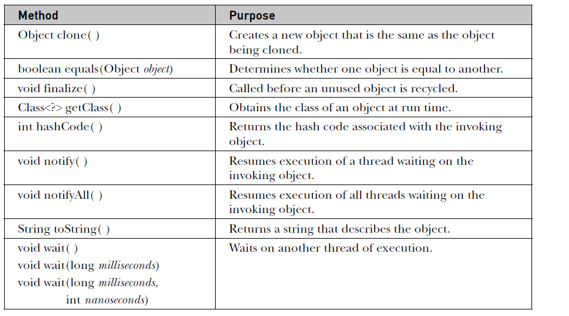

# OOPS in Java

## Core OOPS concepts
> *Object Oriented Programming* is a programming paradigm, that advocates, representation of the problem in software domain, by following the same principles of entities in real world. This is the closest representation of the real world entities in software domain and hence, it is very easy to map the entities from real world to software domain.

* **Object**: An object is any entity that exists concretely or conceptually. In OOP, we abstract an object with the state and behaviour sepcific to the problem domain of an entity.

* **Object in OOP**: An object is a combination of state and behaviour. We can mutate or operate on the state of the object through the exposed behaviour of the object. It is an instance of a class.

In OOP, we abstract the required characteristics of an object in the problem domain and map to a similar entity in the program. We capture the state and behaviour of entities in the problem domain.

The core *OOPS* concepts are
* **Abstraction**: Abstraction is capturing related characteristics (data and behaviour) of an entity, which are specific to the problem domain and ignoring others. For example, to represent a student in a school automation software, we capture properties like *rollNo*, *class* etc, but, ignore properties slike *skin complexion*, *weight*, *hair type* as these are obviously not relevant to the problem that is being solved.
```java
class Student{
	String name;
	int cls;
	long rollNo;

	String getName(){return name;}
}

```
* **Encapsulation**: It is the process of binding data with behaviour of an object, and the ability to expose only the interface to the users. It allows implementation details to be hidden from the users of the object. In java, encapsulation is achieved using a class to define data and behaviour and limit the exposure of the interface using access modifiers.

* **Polymorphism**: It is the capability of different objects responding to the same message differently, enabling, the message sender can keeping sending the same message, being agnostic to the receiver object. This is achieved using *inheritance* and *overriding*.
```java
class Shape{
	private String name; //Name of the shape.
	Shape(String name){
		this.name = name;
	}
	public String getName(){
		return this.name;
	}
	public void print(){
		System.out.println("Shape name: " + this.name);
	}
}
class Line extends Shape{
	private int length;

	Line(String name, int length){
		super(name);
		this.length = length;
	}

	@Override
	public void print(){
		System.out.println("Name: " + getName() + ", Length: " + this.length);
	}
}
class Circle extends Shape{
	private int radius;

	Circle(String name, int radius){
		super(name);
		this.radius = radius;
	}
	public void print(){
		System.out.println("Name: " + getName() + ", Radius: " + this.radius);
	}
}
class Cube extends Shape{
	int volume;
	Cube(String name, int volume){
		super(name);
		this.volume = volume;
	}
	@Override
	public void print(){
		super.print();
		System.out.println("And volume: " + this.volume);
	}
}

public class Test{
	public static void main(String args[]){
        Shape shapes[] = {
        	new Line("Line", 4), 
        	new Circle("Circle", 5),
        	new Line("Big line", 300),
        	new Circle("Large circle", 200),
        	new Cube("Cube", 190),
        	new Shape("None")
        };
        for(Shape shape: shapes){
        	//Test class is the message sender.
        	//The same message is being sent to different objects.
        	//Each object responds in its own way to this very same message.
        	shape.print();
        }
    }
}
```

* **Inheritance**: It is the process of deriving new classes by re-using the definition of existing classes. The newly created class will contain all the properties (data and behaviour) of the base class. It can also add its own properties (data and behaviour), override the inherited properties (data and behaviour). Inheritance allows to achieve code re-use and dynamic polymorphism.

* *Association*
* *Composition*
* *Aggregation*

* **Class**: A class is a blueprint of an object, in which we can define data members, instance methods, static members, static methods and control their visibility.

* **Some OOP terminology VS Programming terminology**: 
* A **method** is a message.
* *Calling* a method on an object is: *send a message to the object*
* The *caller* is the message *sender*.
* The *object* that is processing the message (executing method) is the *receiver* of the message.


### Abstraction
Abstraction is the concept of hiding the implementation details and exposing only the interface to an object.

## Inheritance Basics
* *Super class* / *Base class* / *Parent class*: The class from which one or more classes are being inherited.
* *Sub class* / *Derived class* / *Child class*: A class that is inheriting from some *super class*
* A super class is *generic* and a sub class is *specific*
* A sub class is a specialized version of its super class.
* In Java, a `class` can inherit from only one `class`, but can implement multiple `interface`s.
* **Definition**: *Inheritance* is a process where a class can aquire properties of another class.
* We derive a class from another class using the keyword `extends`
* A sub class object will have all the members of its own class along with the members of all super classes in hierarchy.

```java
class Shape{
	String name; //Name of the shape.
	Shape(String name){
		this.name = name;
	}
}
class Line extends Shape{
	int length;

	Line(String name, int length){
		super(name);
		this.length = length;
	}
}
public class Test{
    public static void main(String args[]){
        Shape sh = new Shape("None");
        Line line = new Line("Line", 5);
    }
}
```

* *Trivia*: A class cannot inherit from itself.

### Member access in Inheritance
* Although, a sub class inherits all the members of its all super classes, it cannot access `private` members of its super classes in the hierarchy.
* A `private` member is strictly `private` to the class - it is not accessible to any other class (except inner class) including its child classes.

```java
class Shape{
	private String name; //Name of the shape.
	Shape(String name){
		this.name = name;
	}
	public String getName(){
		return this.name;
	}
}
class Line extends Shape{
	private int length;

	Line(String name, int length){
		super(name);
		this.length = length;
	}
	void print(){
		System.out.println("Name: " + this.name); //Compiler error - cannot access name.
		System.out.println("Name: " + getName()); //Perfect - Use accessor methods provided by super class.
		System.out.println("Length: " + this.length);
	}
}
public class Test{
    public static void main(String args[]){
        Line line = new Line("Line", 5);
        line.print();
    }
}
```

### Dynamic Polymorphism or Dynamic method dispatch
> **A super class reference variable can reference a sub class object**: 
This is a key feature of inheritance. Apart from code reuse (using inheritance), by referencing sub class objects using super class reference variables, we achieve *dynamic polymorphism*

* **Dynamic polymorphism** is the concept of method binding at runtime as opposed to at compile time (static) binding. When the compiler cannot bind a method call to any particular method, the decision is deferred to runtime. Dynamic binding takes place, when there is
	* Inheritance
	* Overriding
	* A super class reference variable referring a sub class object
	* Such super class reference variable - calling an overridden method
* *Calls to overridden methods are resolved at runtime*


```java
class Shape{
	private String name; //Name of the shape.
	Shape(String name){
		this.name = name;
	}
	public String getName(){
		return this.name;
	}
	public void print(){
		System.out.println("Shape name: " + this.name);
	}
	public void someFunc(){
		System.out.println("Some function of Shape");
	}
}
class Line extends Shape{
	private int length;

	Line(String name, int length){
		super(name);
		this.length = length;
	}

	@Override
	public void print(){
		System.out.println("Name: " + getName() + ", Length: " + this.length);
	}
	
	public int getLength(){
		return length;
	}
}
class Circle extends Shape{
	private int radius;

	Circle(String name, int radius){
		super(name);
		this.radius = radius;
	}
	public void print(){
		System.out.println("Name: " + getName() + ", Radius: " + this.radius);
	}
}
class Cube extends Shape{
	int volume;
	Cube(String name, int volume){
		super(name);
		this.volume = volume;
	}
	@Override
	public String getName(){
		return "";
	}
	@Override
	public void print(){
		super.print();
		System.out.println("And volume: " + this.volume);
	}
}

public class Test{
	static void printShape(Shape p){
		p.print();
	}

    public static void main(String args[]){
        Shape shapes[] = {
        	new Line("Line", 4), 
        	new Circle("Circle", 5),
        	new Line("Big line", 300),
        	new Circle("Large circle", 200),
        	new Cube("Cube", 190),
        	new Shape("None")
        };
        
        shapes[0].print(); //dynamic binding
        shapes[4].print(); //dynamic binding

        for(Shape shape: shapes){
        	//There are 3 implementations of print method in this program.
        	//Which method should the compiler bind the following call to?
        	shape.print();
        	//Compiler cannot decide which method to bind to. Hence,
        	//leaves the decision to run time.

        	shape.someFunc(); //Static binding.
        }

        Circle c = (Circle) shapes[1];
        c.print(); //static binding.
    }
}
```

* The runtime choses the method to call from the type of object, but not from the type of reference variable. In the above example, the reference type is `Shape` for all 4 objects in the array. The statement `shape.print();` results in calling `print` method from the class of the object type (*Circle* or *Line* or *Shape*)

**When a super class reference variable references a sub class object** it can only access those properties (methods or data) that are defined in its own class. For example, from the above example, you cannot call `shape.getLength();` => the *Shape* class does not have *getLength()* defined in itself.

## Using `super` 
* The keyword `super` can be used from within constructors and instance methods.

### Using `super` in constructor
* From a *constructor* of a class, we can call its super class *constructor* using keyword `super`.
* By default, the first statement of any *constructor* is a call to its super class *constructor*.
* If you don't place a call to super class *constructor* in a *constructor* of a class, compiler adds a call to default *constructor* of its super class - as a first statement. Check the following example to understand this. Verify the output of this program.

```java
class Shape{
	Shape(){
		System.out.println("Shape class no argument constructor");
	}
	Shape(int x){
		System.out.println("Shape class one argument constructor");
	}
}
class Box extends Shape{ //Box is a sub class of Shape
	Box(){
		//At this line compiler adds the statement "super();"
		System.out.println("Box class no argument constructor");
	}
	Box(int x){
		//At this line compiler adds the statement "super();"
		System.out.println("Box class one argument constructor");
	}
}
public class Test{
	public static void main(String a[]){
		Box b1 = new Box();
		Box b2 = new Box(4);
	}
}
```

**Output**
```
Shape class no argument constructor
Box class no argument constructor
Shape class no argument constructor
Box class one argument constructor
```

* **Call to super class constructor must be the first statement**: If you want to call a super class constructor, it must be the first statement in the sub class constructor.

```java
class Shape{
	Shape(){
		System.out.println("Shape class no argument constructor");
	}
}
class Box extends Shape{ //Box is a sub class of Shape
	Box(){
		System.out.println("Box class no argument constructor");
		super(); //compiler error
	}
}
public class Test{
	public static void main(String a[]){
		Box b1 = new Box();
	}
}
```

**Output demonstrating the compiler error**
```
Test.java:9: error: call to super must be first statement in constructor
                super(); //compiler error
                     ^
1 error
```

* We can call any constructor of super class from a sub class constructor.
```java
class Shape{
	Shape(){
		System.out.println("Shape class no argument constructor");
	}
	Shape(int x){
		System.out.println("Shape class one argument constructor");
	}
}
class Box extends Shape{ //Box is a sub class of Shape
	Box(){
		super(5); //Calling one argument constructor of super class.
		System.out.println("Box class no argument constructor");
	}
	Box(int x){
		super(); //Calling no argument constructor of super class.
		System.out.println("Box class one argument constructor");
	}
}
public class Test{
	public static void main(String a[]){
		Box b1 = new Box();
		Box b2 = new Box(4);
	}
}
```

**Output**: Read the code above and validate your understanding with the output below.
```
Shape class one argument constructor
Box class no argument constructor
Shape class no argument constructor
Box class one argument constructor
```

* We can call a super class constructor explicitly, even if it is not defined by us.
```java
class Shape{
	
}
class Box extends Shape{ //Box is a sub class of Shape
	Box(int x){
		super(); //We have not defined any constructor in super class.
		//Here we are calling compiler provided default constructor.
		//However, the above call is redundant. Compiler will anyway add this statement.
		System.out.println("Box class one argument constructor");
	}
}
public class Test{
	public static void main(String a[]){
		Box b2 = new Box(4);
	}
}
```

**Output**: Validate your understanding of above code by cross checking with the following output.
```
Box class one argument constructor
```

* We can only call one super class constructor from its sub class constructor.
```java
class Shape{
	Shape(){
		System.out.println("Shape class no argument constructor");
	}
	Shape(int x){
		System.out.println("Shape class one argument constructor");
	}
}
class Box extends Shape{ //Box is a sub class of Shape
	Box(){
		//Error: We are trying to call two super class constructors.
		super(); //Calling default constructor.
		
		super(5); //We are violating the rule that the super class constructor call must be the first statement. 
		//Here, this is second statement.

		System.out.println("Box class no argument constructor");
	}
}
public class Test{
	public static void main(String a[]){
		Box b1 = new Box();
	}
}
```

**Output**: By adding a call `super(5)`, we are violating the rule that the super class constructor call must be the first statement in the sub class constructor.
```
Test.java:14: error: call to super must be first statement in constructor
                super(5); //We are violating the rule that the super class constructor call must be the first statement.
                     ^
1 error
```

### Using `super` in instance methods
* If a sub class is overriding a method of a super class, then, if the sub class method want to call the super class version of the method, we can qualify the super class method name with keyword `super`. This is demonstrated in the following example.
```java
class Shape{
	String name;

	public void print(){
		System.out.println("The name: " + name);
	}
}
class Box extends Shape{ 
	int width, height, depth;
	
	@Override
	public void print(){
		super.print(); //Call the super class print method.
		System.out.println("Dimensions: " + width + ", " + height + ", " + depth);
	}
}
public class Test{
	public static void main(String a[]){
		Box b1 = new Box(); //Default name and unit box.
		b1.print();
	}
}
```

**Output**:
```
The name: null
Dimensions: 0, 0, 0
```

* The `super` keyword or `this` keyword are not available in `static` methods. Hence, we cannot call a super class method from a `static` method of a sub class.

### A sub class defining same instance variable as super class
> At times, we can have a sub class defining an instance variable, which is same as the name of a super class instance variable. In such cases, the sub class member will hide the super class member. To access a super class instance member, we can use `super` to refer to it. The statement `super.member` (method or instance property), will do search for the implementation starting in immediate super class and up the hierarchy there after. The property will be accessed from the closest ancestor.
```java
class TheBase{
	int counter = 66; //This cannot be accessed directly by Shape class
}
class Something extends TheBase{
	int counter = 56;
}
class Shape extends Something{
	String name = "Shape";
}
class Box extends Shape{ 
	String name = "Box"; //same as the one defined in Shape class.
	int counter = 45; //Same as the one defined in Something class.
	
	public void print(){
		System.out.println("Box counter: " + counter);
		System.out.println("Something counter: " + super.counter); //From Something - the closest ancestor
		System.out.println("Name defined in super class: " + super.name);
		System.out.println("Name defined in sub class: " + name);
	}
}
public class Test{
	public static void main(String a[]){
		Box b1 = new Box();
		b1.print();
	}
}
```

**Output**
```
Box counter: 45
Something counter: 56
Name defined in super class: Shape
Name defined in sub class: Box
```

### Order of exeuction of constructors - in inheritance
> When we instantiate an object of a class, the *constructor* of that class and all its super classes must be executed. The order of execution of these constructors follows the order of derivation. The first call is made to the constructor of the class of which the object is being created. That in turn calls (implicitly or explicitly) its immediate super class constructor as the first statement and this continues until the constructor of *Object* class. Hence, the first constructor to finish the execution is the *Object* class constructor and the last constructor to finish the execution is of the class of which we are creating an object.


## Calling a constructor from another constructor of same class using `this`
* We can call a *contructor* from another *constructor* of the same class. This is helpful in re-using the initializations done by other constructors. The following program presents a use case where calling a constructor from another one of the same class is useful.
```java
class Box{ //Box is a sub class of Shape
	int width, height, depth;
	String name;

	Box(){
		//Adds a default value to name
		this("A Box"); //Call one argument constructor.
		System.out.println("Box class no argument constructor with default name.");
	}

	Box(String name){
		//Adds default values for width, height and depth
		this(name, 1, 1, 1); //Call 4 argument constructor.
		System.out.println("A box with given name and unit dimensions");
	}

	Box(String name, int w, int h, int d){
		this.name = name;
		this.width = w;
		this.height = h;
		this.depth = d;
		System.out.println("A box with given and dimensions.");
	}
}
public class Test{
	public static void main(String a[]){
		Box b1 = new Box(); //Default name and unit box.
		Box b2 = new Box("Big box");
	}
}
```

**Output**:
```
Shape class no argument constructor
A box with given and dimensions.
A box with given name and unit dimensions
Box class no argument constructor with default name.
Shape class no argument constructor
A box with given and dimensions.
A box with given name and unit dimensions
```

## Abstract Classes
> A class is a characterization of an entity. It can hold the entities state and define behaviour. At times, as part of generalization, in inheritance, it is possible to define an entity's behaviour only partially - in such cases, the class that is defining such partial behaviour is said to be incomplete. The behaviour needs to be completed by its sub classes. Such partial classes can be called as `abstract` classes.

**Example**: In the following example, the super class *Shape* is an abstraction of the common functionality of all kinds of shapes that are being represented in the program. We can represent a *Box* and a *Cube* - these are the concrete entities that we can represent. The *Shape* itself is an abstraction. We don't have any entities of *Shape* to represent. Hence, the *Shape* class is purely present to act as a base class - but, not to create instances of it. Such *Shape* class can be declared as `abstract`, which prevents us from instantiating it.
```java
abstract class Shape{//Notice keyword abstract
	String name;

	void print(){
		System.out.println("Name is: " + name);
	}
}
class Box extends Shape{ 
	int width, height, depth;
	
	public void print(){
		super.print();
		System.out.println("Dimensions: " + width + ", " + height + ", " + depth);
	}
}

class Cube extends Shape{ 
	int radius, height;
	
	public void print(){
		super.print();
		System.out.println("Dimensions: " + radius + ", " + height);
	}
}

public class Test{
	public static void main(String a[]){
		Box b = new Box();
		Cube c = new Cube();
		Shape s = new Box();
		Shape s2 = new Cube();
		Shape s3 = new Shape(); //Error. Cannot instantiate an abstract class.
	}
}
```

**Output**
```
Test.java:32: error: Shape is abstract; cannot be instantiated
                Shape s3 = new Shape(); //Error. Cannot instantiate an abstract class.
                           ^
1 error
```

**Abstract fact sheet**
* The qualifier `abstract` will make a class abstract.
* An abstract class cannot be instantiated.
* The `abstract` qualifier will make a method as abstract. When we know that in the base class, that a behaviour exists, but, the implementation depends on the sub classes, then, we will define `abstract` methods.
```java
//As this class contains an abstract method, the class must be declared as abstract.
abstract class Account{//Notice keyword abstract
	String accountHolderName;
	double balance;

	double getBalance(){//Concrete implementation
		return balance;
	}

	//abstract declaration. No method implementation possible.
	abstract double computeInterest(); 
	//We know that an account must have computeInterest operation,
	//but, the specific way of computing interest will depend on type of account.
	//Only subclasses can implement this.
}

//This class must implement the abstract method computeInterest of Account class.
//If not, this class will also needs to be declared as abstract.
class SavingsAccount extends Account{
	@Override 
	double computeInterest(){
		return getBalance() * 0.09;
	}
}

class RecurringAccount extends Account{
	@Override 
	double computeInterest(){
		return getBalance() * 0.11;
	}
}

public class Test{
	public static void main(String args[]){
		SavingsAccount sa = new SavingsAccount();
		RecurringAccount ra = new RecurringAccount();
		sa.computeInterest();
		ra.computeInterest();

		Account a = sa; //We can create reference variable of an abstract class.
		a.computeInterest(); //dynamic binding.
		a = ra;
		a.computeInterest();
	}
}
```

* If a class contains at least one `abstract` method, then the class must be declared as `abstract` - because, the presence of an `abstract` method indicates a missing behaviour, which inturn denotes that the class definition is not complete - hence, class must be declared as `abstract`
* It is not necessary for an `abstract` class to have `abstract` methods. In the first example, the *Shape* class does not contain any `abstract` methods, but, it is qualified as `abstract` - It is a notional indication that the class definition is not concrete and do not create objects of it.
* A class must implement the abstract methods (missing implementations) derived from any of its ancestors and are not implemented anywhere in its hierarchy. If not, the class must be qualified with `abstract`.
```java
abstract class ClassA{
	abstract void check(); 
}

//The child of this class must implement two methods
//check() and test() to become concrete.
abstract class ClassB extends ClassA{
	abstract void test();
}

//This class is abstract because the check() method is not implemented.
//The sub classes of this class should implement check() to become concrete class.
abstract class ClassC extends ClassB{
	@Override 
	void test(){
		System.out.println("ClassC test method");
	}
}

//It must implement check() method.
//The test() method is implemented in its ancestors.
class ClassD extends ClassC{
	@Override
	////This must be implemented.
	//If not, even this class should be declared as abstract
	void check(){ 
		System.out.println("ClassD check method");
	}
}
public class Test{
	public static void main(String args[]){
		ClassD d = new ClassD();
	}
}
```

## The `final` class and `final` method.
> The keyword `final` can be used to create a constat local variable or static or instance member variable.

```java
public class Test{
	static final int y = 40; //inline initialization.
	static final int a; //Must be initialized in static block.
	static final int f; //Compiler error. This is not initialized any where. 
	static{
		a = 20; //A static final member can be initialized in static block.
		y = 12; //Compiler error. We cannot assign a static member - it is already initialized.
	}

	final int x = 90; //inline initialization of instance member.
	final int z; //This must be initialized in constructor.
	final int k; //Compiler error. We are not initializing it, even in constructor.

	Test(){
		//A final data member which is not initialized in declaration
		//must be (must be) initialized in constructor.
		//If not, it is a compiler error.
		z = 56;
		x = 100; //Compiler error. Re-initialization of final member. Not allowed.
	}
	public static void main(String args[]){
		final int c = 50; //final local must be initialized. No other way.
		final int d; //We cannot change this value after this line.
		//Neither we can use this. Hence, it is useless.

		System.out.println("d: " + d); //Compiler error. 
	}
}
```

> `final` class: Final class is a class that cannot be extended by any other class. An abstract class cannot be made `final` as it neither can be instantiated nor inherited.

```java
final class Some{
	
}
//Compiler error: Final class cannot be inherited.
class Other extends Some{

}
//Compiler error: Abstract class cannot be final
final abstract class SomeOther{
	//An abstract class cannot be instantiated.
	//It is meant to be inherited.
	//And final prevents it from inheriting.
	//Which makes the class rendered useless.
}

public class Test{
	public static void main(String args[]){
		
	}
}
```

> `final` method: A `final` method of a class cannot be *overriden* by its sub class. As the name suggests, it is the final implementation of the method. Hence, cannot be overridden.

## The `Object` class
> `java.lang.Object` is a special class in java. It is the super class for all classes. If you define a class and you don't inherit from any class, compiler makes it a sub class of `java.lang.Object` class. Hence, java inheritance hierarchy ends at `Object` class. 
> The *Object* class implements some useful operations which are available to all classes, due to inheritance.
> As *Object* is the super class to any class (either immediate super class or an ancestor), *Object* class reference can refer to any object. `Object obj = new <AnyClass>();`



## Packages
> A package is a namespace provider for classes in java. Class names in a package must be unique, but can have duplicate names across packages. A class palced inside a package needs to be qualified with package name to refer to it.

* Declaring a class belongs to a package: In the following example, the class `Test` is inside the package `a.b.c`. Hence, the fully qualified name of this class is `a.b.c.Test`.
```java
package a.b.c;

class Test{}
```
* Package declaration should be the first statement in a java source file. All the java classes defined in that source file belong to the same package. In the following example, we are defining 3 classes in the same source file. The package declaration is `come.some` -> All these 3 classes are in the same package.
```java
package com.some;

class A{}
class B{}
class C{}
```
* A package (logical namespace container) can contain any number of classes. And, these classes can be defined in any number of files in any folder. In the following example, we are defining 3 different classes in three different files (could be in different folders too) - but, all of them are part of the samel package `com.some`.
```java
//A.java
package com.some;

public class A{}

//B.java
package com.some;

public class B{}

//C.java
package com.some;

public class C{}
```

* When java compiler compiles a java class, the produced *.class* file is placed in a path matching the package hierarchy of the class. The following example contains 3 classes defined in 3 different packages in different paths. Please note that the compiler has created the folder structure matching that of package structure for each of these classes.
```java
//D:\source\util\A.java
package com.util;
public class A{}

//D:\source\others\B.java
package com.testing;
public class B{}

//D:\source\banking\C.java
package com.finance;
public class C{}

//Compile the above classes with the following commands.
//D:\source>javac -d ./output util/A.java
//D:\source>javac -d ./output others/B.java
//D:\source>javac -d ./output banking/C.java

//Compiler produces the following files
//D:\source\output\com\util\A.class
//D:\source\output\com\testing\B.class
//D:\source\output\com\finance\C.class
```

* It is a convention that, create the source files in a folder structure that matches the package hierarchy.

### Classpath
